# IDCT Lab

## Contents
1. [Introduction](#Introduction)
1. [Prerequisites](#Prerequisites)
1. [Setup](#Setup)
1. [Run Emulations](#Emulation)
1. [Analyzing the Reports](#Analyzing)
1. [Optimization](#Optimization)
1. [Executing on F1](#Executing-on-F1)
1. [Conclusion](#Conclusion)
1. [References](#References)

<a name="Introduction"></a>
## Introduction  
This tutorial is designed to help teach the basics of the SDx IDE as well as the SDAccel development process. Areas covered include creating a project, running software and hardware emulation, and emulation report analysis to help identify how to optimize code. Additionally, at the end of the tutorial, various links are provided to resources which provide details on various aspects of optimizing kernel code for projects.

The design is a Inverse Discrete Cosine Transform, which is used heavily in audio/image processing and is based off of the Fourier Transform. Please refer to the Wikipedia article  [Discrete Cosine Transform](https://en.wikipedia.org/wiki/Discrete_cosine_transform) for more information. 

 
<a name="Prerequisites"></a>
## Prerequisites

### General
This example assumes:
*   The aws-fpga git is cloned into directory ~/aws-fpga

*   The actual design files krnl_idct.cpp and idct.cpp is present in ~/SC17_Developer_Lab/idct/src/

    If any of these directories are different in your setup, please replace any reference in the tutorial to point to your installation directories. 

*   You are logged into your AWS-F1 instance and viewing the graphical desktop environment. The following steps assumes as a starting point an active terminal on the graphical desktop running the default “bash”-shell

### Environment Configuration
Before the SDAccel tool suite can be started, the environment needs to be configured. Follow these steps:

1.  Change into the ~/aws-fpga directory and source “sdaccel_setup.sh” <br>
    ```
    cd ~/aws-fpga
    source sdaccel_setup.sh
    source $XILINX_SDX/settings64.sh 
    ```
    The setup might create some warning messages regarding missing libraries but these can be safely ignored.

1. Launch SDx with the command: 
    ```
    sdx
    ```
    The **Eclipse Launcher** will start up displaying the workspace directory menu. This allows you to select the location of your workspace (and projects). For this example, create a workspace in your root directory or next to your idct directory by selecting: **Browse… -&gt; Create Folder -&gt; name it “workspace” &lt;Enter&gt; -&gt; OK**. 
   
   The Workspace path should read **&lt;home&gt;/workspace**. 
    
    Click **OK**.  


    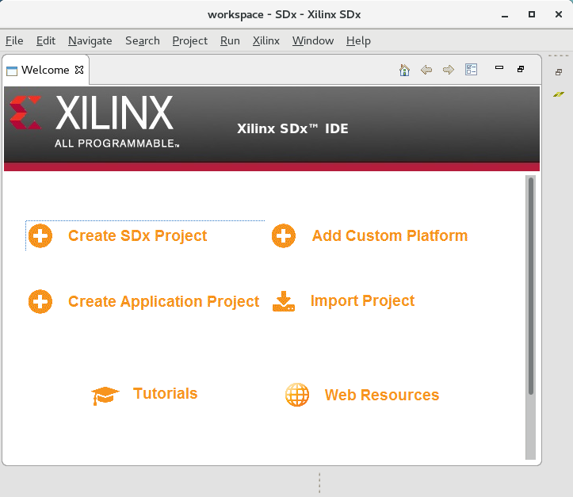

3. The SDx Welcome screen should be visible (as below). The next step is to have the the Amazon F1 Platform recognized by the project. This requires the addition of a custom platform. On the Welcome screen: Select **Add Custom Platform -&gt; Add CustomPlatform… -&gt;** navigate to **~/aws-fpga/SDAccel/aws_platform/Xilinx_aws-vu9p-f1_4ddr-xpr-2pr_4_0 -&gt; OK**.

    Click **OK** again in the Hardware Platform Repositories form (below).  
    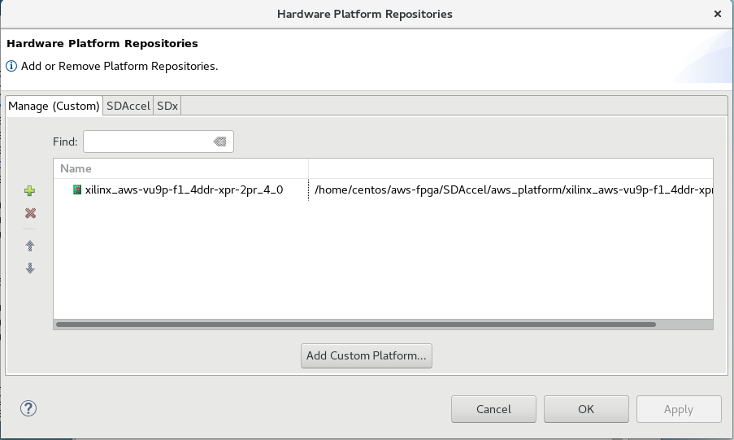
 
4. The initial setup for an AWS-F1 project is now complete. Create a new project through the **Create SDx Project** button on the Welcome screen.  
 
1. In the **Project name** field of the **New Project** window type **IDCT** (as below). Click **Next**.  
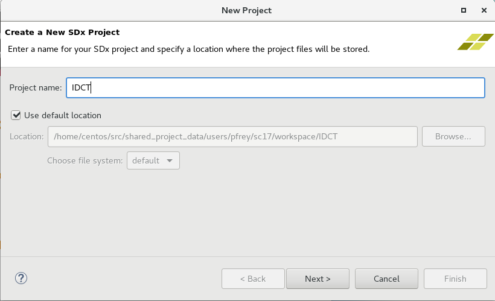

1. In the **Choose Hardware Platform** window select the **AWS-VU9P (4ddr-xpr-2pr) (custom)** platform. Click **Next**.

1. The **Software Platform** window only has **Linux on x86** and **OpenCL** as valid options. Click **Next**. 

1. The **Templates** window shows all the downloaded Github examples (see below). However, in this tutorial we will are not starting with any of the installed templates. Select **Empty Application** and click **Finish**.  
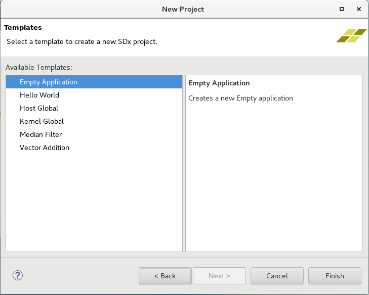

1. You have now successfully created a new SDAccel project called IDCT for the AWS-VU9P-F1 platform. This is prominently displayed in the SDx Project Settings window in the center of the GUI. Following is a brief description of the different sections of the default GUI elements (see figure below for reference):
    * The **main menu** bar is located on the top. This menu bar allows direct access to all general project setup and GUI window management tasks. As most tasks are performed through the different setup windows, the main menu is mostly used to recover from accidently closed windows or to access the tool help.
    * Directly below the main menu bar is the **SDAccel toolbar**.  This provides access to the most common tasks in a project. From left to right, these are: File Management functions (new, save, save all), Configuration Management, Build, Build All, Start Debug, and Run. Most buttons have a default behavior as well as pulldowns.
    * The **Project Explorer** window occupies the top left hand side of the GUI. This window is used to manage and navigate through project files. 
    * In the middle is the **SDx Project Settings** window. This window is intended for project management and presents the key aspects of an SDx Project. 
    * The **Outline window** on the right hand side is used for file navigation. The content of the outline varies depending on the file currently selected in the main window.
    * In the bottom left section is the **Reports window**. This allows easy access to all reports generated by SDAccel. 
    * The remaining windows along the bottom of the main window accommodate the various consoles and terminals which contain output information relating to individual SDAccel executables. Typical output examples are compilation errors or the tool output when running.  

 
<a name="Setup"></a>
## Setup the Project

This section shows how to setup SDAccel. It includes how to import source files from the local file system into the project, determine hardware functions, and generally configure the SDAccel flow.

1. From the **Project Explorer** window, right click the **src** directory and select **Import…**  
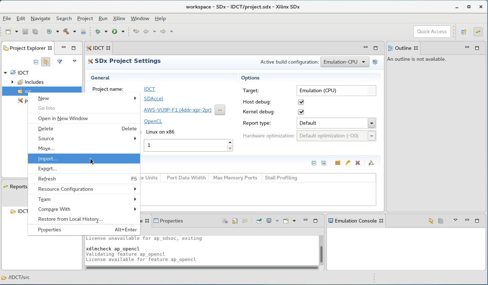

1. In the **Import** window, navigate to **General &gt; File System**. Click **Next**.  
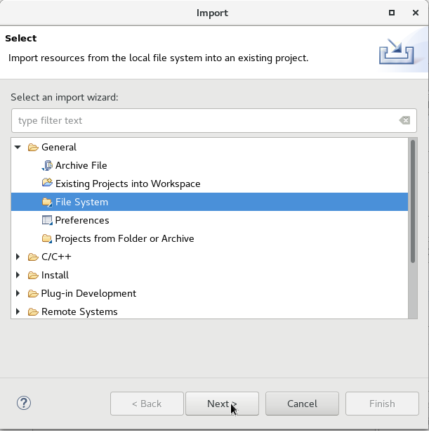

1. In the next window, click **Browse** and navigate to where the **IDCT** source files are located (~/SC17_Developer_Lab/idct/src). Click **OK** to accept the source directory. The file system will then show the two files contained in the directory. Select both files and click **Finish**.  
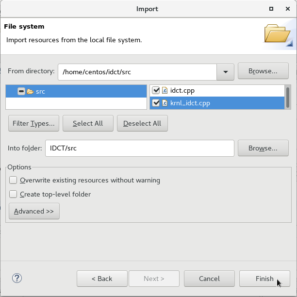

1. Use **Project Explorer**to verify that both files were included in the project. Expand the **src** file to and check to ensure all files were added successfully.  
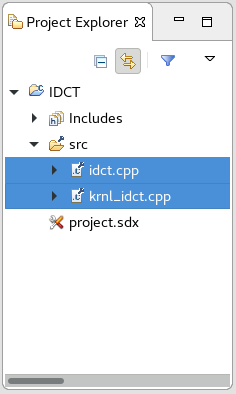

1. The next step is to identify the functions to be implemented in hardware (i.e., accelerators / kernels). This is performed through the **SDx Project Settings** window. As the source files have already been entered, sdx will help identify the accelerators. 

    Click the **Add Hardware function…** button: . The **Add Hardware Functions** window pops up (see below).  This will analyze the source code provided and identify potential hardware functions.
    Select the **krnl_idct** function and click **OK**.  
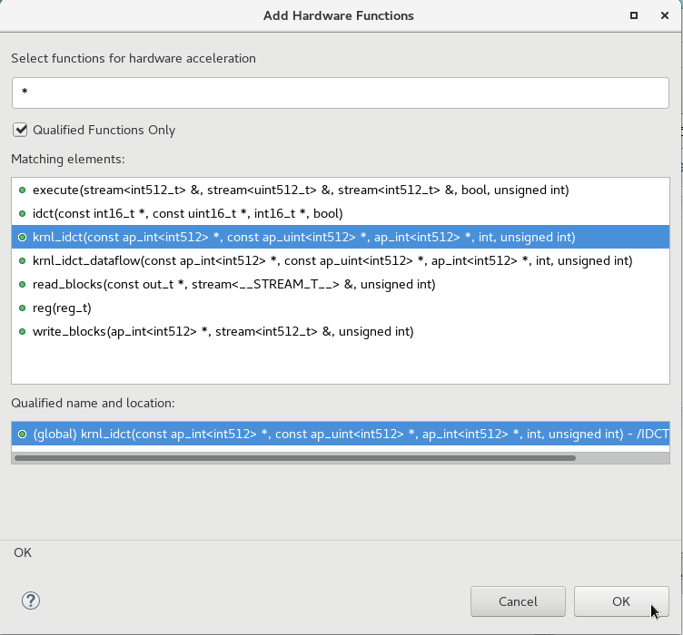

1. The **Hardware Functions** section now contains a binary container that includes the **krnl_idct** function (see below).   
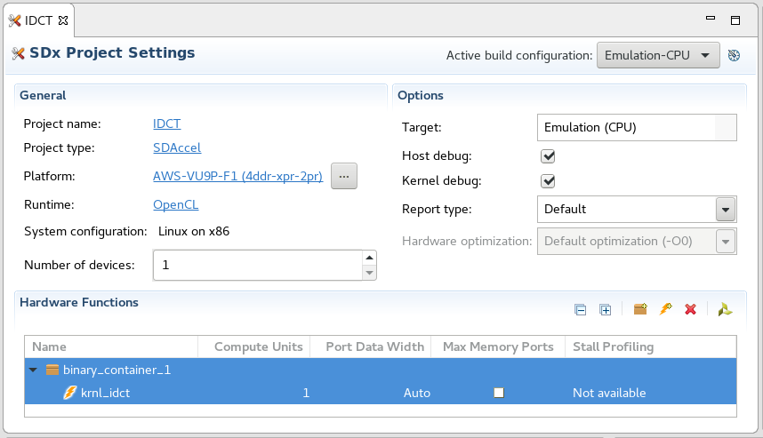

1. The next step is to configure the kernel and the Host to utilize two different DDR memories; one for reads and one for writes. This mapping of AXI master ports needs to be set during the link stage of the kernel compilation step. To do that, select: **Properties** from the **Project** menu in **Main Menu** bar. Expand the **C/C++ Build** menu item and select **Settings** from the submenu (see below).  

    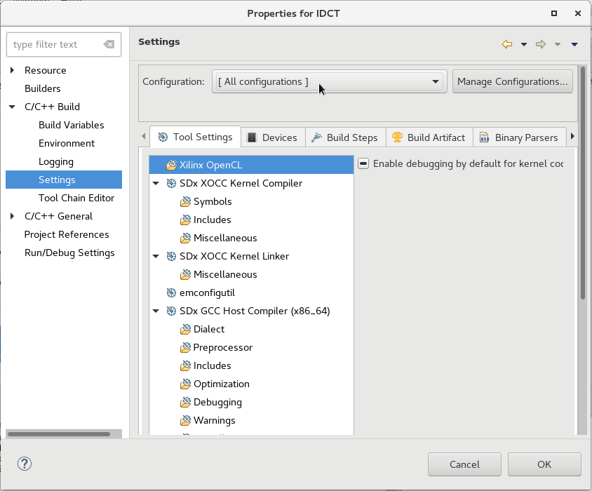  

    Select **[All configurations]** from the Configuration dropdown menu (see above). This ensures that the mapping is applied to all build configurations. 
    
    Select the **Tool Settings** tab and navigate to the **SDx XOCC Kernel Linker -&gt; Miscellaneous** section (see below). On the right hand side (Other flags), you can specify additional link options such as the AXI master mapping commands. 
    
    Add the following three options in this window (one line):
    ```
    --xp misc:map_connect=add.kernel.krnl_idct_1.M_AXI_GMEM.core.OCL_REGION_0.M00_AXI 
    --xp misc:map_connect=add.kernel.krnl_idct_1.M_AXI_GMEM1.core.OCL_REGION_0.M00_AXI 
    --xp misc:map_connect=add.kernel.krnl_idct_1.M_AXI_GMEM2.core.OCL_REGION_0.M01_AXI
    ```
    Click **OK**.
    
    **Note**: More information regarding the mapping command can be found in the [UG1023 SDAccel Environment User Guide](https://www.xilinx.com/support/documentation/sw_manuals/xilinx2017_2/ug1023-sdaccel-user-guide.pdf).  
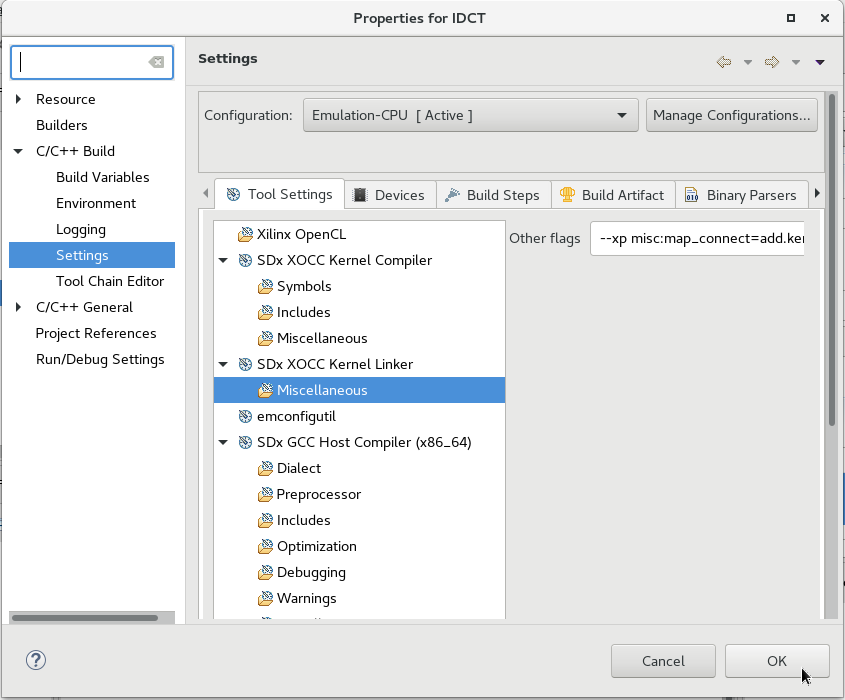


1. For the purpose of this tutorial, you will now overwrite some default SDx behavior. To do this, add the absolute path of the HLS configuration file to the Kernel Compiler by selecting **Properties** from the **Project** menu in **Main Menu** bar, expand the **C/C++ Build** menu item and select **Settings** from the submenu (see below).

    Again, select **[All configurations]** from the Configuration dropdown menu to ensure that the mapping is applied to all build configurations. Next, select the **Tool Settings** tab and navigate to the **SDx XOCC Kernel Compiler -&gt; Miscellaneous** section (see below). On the right hand side, you can specify additional compile options. Add the following and click **OK** to confirm.
    ```
    --xp prop:solution.hls_pre_tcl=~/SC17_Developer_Lab/idct/support/config.tcl
    ```  
    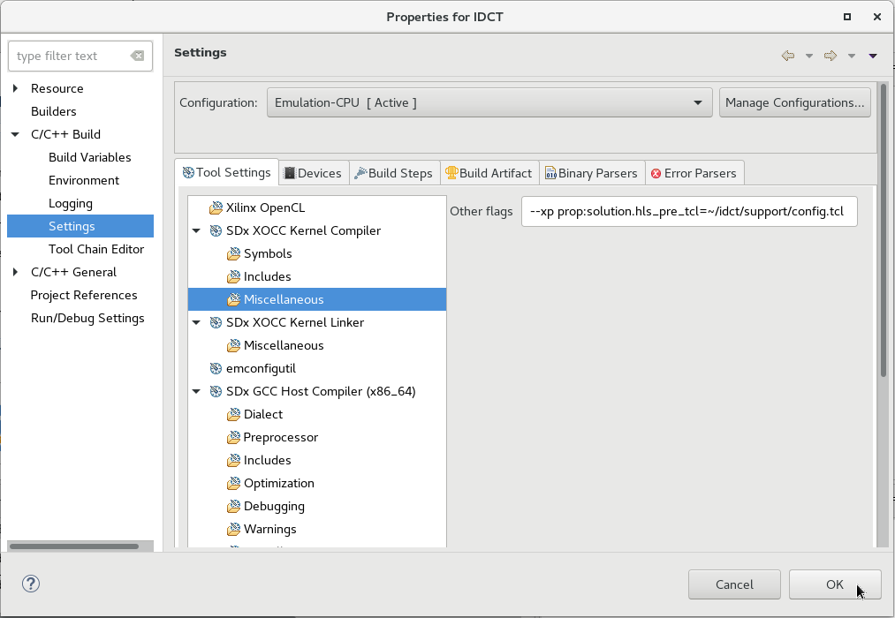

1. This design is setup to receive the filename of the bitstream as command line argument. This is especially useful during initial design flow when designers may often switch between emulation modes, as it provides a simple way to avoid host code modifications based on build configuration. 
    From the **Main Menu**, select **Project** then **Properties**. 
    
    Click on the **Run/Debug Settings** menu item. 
    
    Select the **IDCT-Default** configuration and click **Edit…**.   

    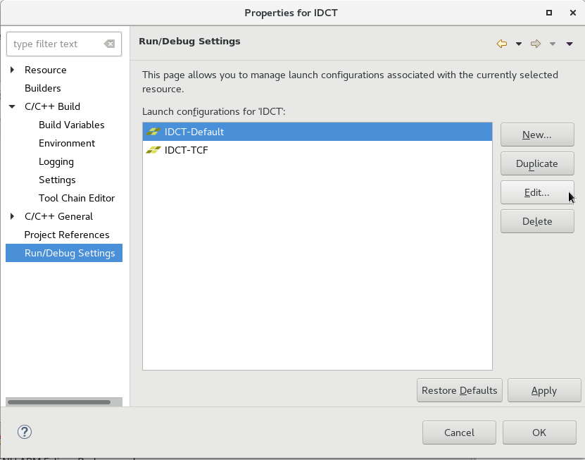  

    In the **(x)= Arguments** tab check the **Automatic add binary container(s) to arguments** option (see below). This adds ../binary_container_1.xclbin to the program argument list. 
    
    Click **OK** twice in the Properties for IDCT window. Runtime environment configuration is now complete.  

    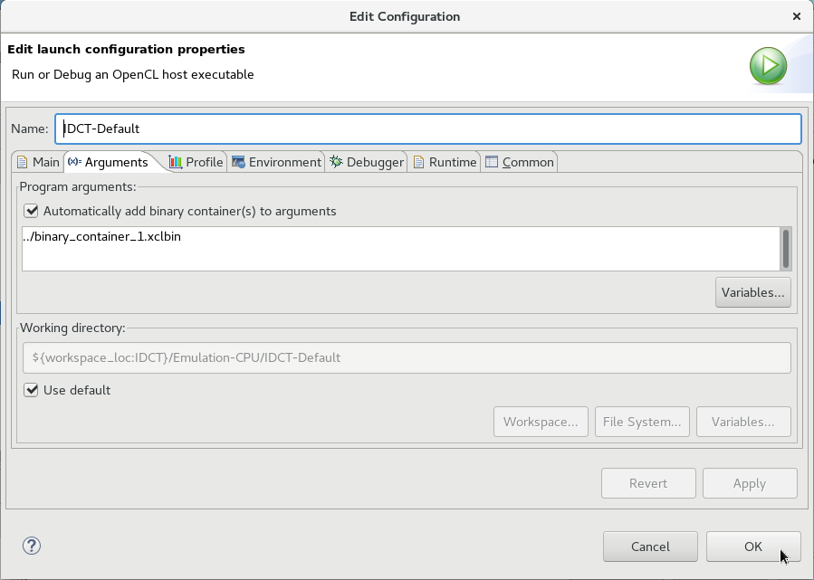

<a name="Emulation"></a>
## Run Emulations (Software/Hardware)  

This section demonstrates the software/hardware emulation flow. 

The project is now setup and ready for compilation and emulation. The SDx environment uses Makefiles to perform incremental compilation of the project. This means that unless file changes require the recompilation of the host code or of the kernel code, no compilation is performed.

In the upper right corner of the **SDx Project Settings** window, the current configuration is shown. Ensure that **“Emulation-CPU”** is selected. CPU-Emulation is intended to verify the algorithm and identify syntax issues through pure C/C++ emulation. To run software emulation for the design, click the **Run** button, . This will build both the kernel and host code and execute emulation.

Notice that the **Console** has a detailed build log of compiling the kernel first and then the host code. Once the build is complete, an output console will display any standard output the application produces. 

When the software emulation is complete:

   Click the dropdown **Emulation-CPU** in the **SDx Project Settings** window. 
   
   Select **Emulation-HW**. 
    
Now the project is set for running a more detailed emulation compared to the software emulation. In this emulation mode the actual Register Transfer Logic (RTL) generated from the C/C++ is simulated and run together with the host code application. 

Click the **Run** button again.

The runtime of the Hardware emulation will take longer than the Software Emulation because the kernel code is being compiled to create the more detailed simulation models and linked with the platform. In addition, the more detailed simulation models require more simulation time. However, this allows more accurate reporting of kernel performance in comparison to software emulation. This step should be used in helping identifying performance issues of the design.

The next section will focus on analyzing the reports produced by both analysis runs. 

<a name="Analyzing"></a>
## Analyzing the Reports  

This section covers how-to locate and read the various reports generated by the emulation runs. The goal of the section is to understand the analysis reports of SDAccel before utilizing them in the next section.  
    

1. The **Reports** window displays a tree layout of folders and reports for all runs and open projects (see above). The top level shows the **IDCT** project for which we have executed two runs (**Emulation-CPU** and **Emulation-HW**).

    Expanding the **Emulation-CPU** folder shows the **IDCT-Default** run configuration. Running this configuration created a **Profile Summary** and **Application Timeline** report. 

    Similarly, the **Emulation-HW** folder contains all reports created with this build configuration. However, as this configuration performs High-Level Synthesis under the hood, first estimates regarding the performance of the actual hardware implementation are available. These are summarized in **System Estimate** and and are also accessible in more detail from the **HLS Report** located in the **binary_container_1 -&gt; krnl_idct** subhierarchy. Similar to the emulation-cpu flow, the run configuration **IDCT-Default** also produced a **Profile Summary** and an **Application Timeline** report.

1. First look at the **Emulation-CPU Profile Summary**. Double click the **Profile Summary** to open the report (see below).   
     

    This report provides data related to how the application runs. Notice that the report has four tabs: **Top Operations**, **Kernels & Compute Units**, **Data Transfers**, and **OpenCL APIs**. Click through and study each of the tabs and become familiar with the data they show. Following is a summary of each:

    **Top Operations**: Shows all the major top operations of memory transfer between the host and kernel to global memory, and kernel execution. This allows you to identify throughput bottlenecks when transferring data. Efficient transfer of data to the kernel/host allows for faster execution times.
    
    **Kernels & Compute Units**: Shows the number of times the kernel was executed. Includes the total, minimum, average, and maximum run times. If the design has multiple compute units, it will show each compute unit’s utilization. When accelerating an algorithm, the faster the kernel executes, the higher the throughput which can be achieved. It is best to optimize the kernel to be as fast as it can be with the data it requires.
    
    **Data Transfers**: This tab has no bearing in software emulation as no actual data transfers are emulated across the host to the platform. In hardware emulation, this shows the throughput and bandwidth of the read/writes to the global memory that the host and kernel share.
    
    **OpenCL APIs**: Shows all the OpenCL API command executions, how many time each was executed, and how long they take to execute.

1. Now examine the **Application Timeline** report. Double clicki it in the **Emulation-CPU** hierarchy. This shows a visual representation of the **OpenCL APIs** from the **Profile Summary** and in what order the APIs execute across the emulation threads (see below).  
    

1. Next, look at the **Emulation-HW** reports. Double click on the **HLS Report**. This report is specific to the kernel code, and how it translates to the platform. It contains information about clocking, resources, device utilization, and more. For the purpose of this tutorial, the only section of this report to pay attention to is the **Performance Estimates**. This section provides information on the latency of the kernel, as well as loop implementation details (see below).  
    

1. Close all reports before moving on to comparing two reports side by side. Click **X** on each of the report tabs to close.

1. Open the **Profile Summary** of the **Emulation-HW** run. Drag it to the right (next to the Outline tab) such that the center window can be used to show the **Profile Summary** of the **Emulation-CPU** run. This allows you to directly compare the two reports. Based on your screen, to allow the maximum information to be displayed, it may be best to maximize the application window and minimize the Project Explorer and Reports windows (see below).  
    
 
1. Notice that compared to the CPU emulation, the hardware emulation displays more data as well as a **Profile Rule Checks** section. This section provides information relating to the overall design performance. Profile rules examine the profile data and compare them to general threshold values. If a check does not meet the threshold value, the right hand column provides guidance on how to improve design performance.

1. Click on the **Kernels & Compute Units** tabs of both reports to compare the software and hardware emulation reports of the kernel execution. Notice that in software emulation, the total time is significantly more than in hardware emulation. This is because in software emulation, the host and kernel are running only on the CPU, while the hardware emulation is running in a simulation mode that emulates what the platform would be executing. This sounds counter-intuitive given that the Hardware Emulation wall clock runtime is much larger. However, this longer runtime is due to the much greater detail of the simulation run.
 
1. Next, take some measurements to establish a baseline of the current implementation of the design. To do this, note the values for the following from the **Profile Summary** report of the **Emulation-CPU** run:

    - Kernel Total Time (ms):
    - Kernel Min Time (ms):	
    - Kernel Max Time (ms):	


    Then for the Emulation-HW configuration, note the **Kernel Total Time** from the **Profile Summary** and from the **HLS Report -&gt; Performance Estimates** section the latency and interval numbers. 

    - Kernel Total Time (ms):
    - Latency (min/max):
    - Interval (min/max):	

This concludes the introduction to the SDAccel GUI Analysis capabilities. The next section will focus on some of the performance aspects of the current implementation and how they can be improved.  

<a name="Optimization"></a>
## Optimization   

In the previous section you familiarized with the SDAccel Performance Analysis capabilities. The next stage is to utilize the analysis capabilities to determine results of kernel optimization procedures. This example will deal with ARRAY_PARTITON and DATAFLOW optimization. A full list of optimizations can be found in [UG1253 – SDx Pragma Reference Guide - Chapter 4](https://www.xilinx.com/support/documentation/sw_manuals/xilinx2017_2/ug1253-sdx-pragma-reference.pdf).

1. Open the kernel file **krnl_idct.cpp** by double clicking the file at the bottom in **Project Explorer**. At the end of the file is the krnl_idct top function which is used to separate the HLS interface pragmas from the actual kernel definition function (krnl_idct_dataflow) for readability. The krnl_idct_dataflow function contains four blocks:

    * Two read_blocks responsible for mapping the AXI interface to a data stream
 
    * One write_block responsible for mapping from the data stream to the output AXI interface
 
    * One execute block which contains the IDCT computation

    The execute function performs multiple idct computations per kernel execution. The actual number is provided to the kernel as an argument. Each computation is prepended by reading the wide input data streams and filling the 8x8 matrix, and similarly post processed by writing into the wide output streams. 
    
    **Note:** The coefficients of the read operation are read only once as they are considered constant for all idct computations.

1. First, look at the data access pattern of the design. You will need to look at the data formatting and determine whether it allows efficient pipelined execution. Problematic code usually involves arrays as these get mapped to memories. Memories are resources with a limited number of ports which can introduce sequential behavior and artificial latency. 

    Next, look at the **HLS Report**, and specifically at the **latency** of the **krnl_idct** in the **Performance Estimates** section. Notice the large value. Looking at the instance section below, you can see the main contributor of this latency is the instance of the **krnl_idct_dataflow** module.  

    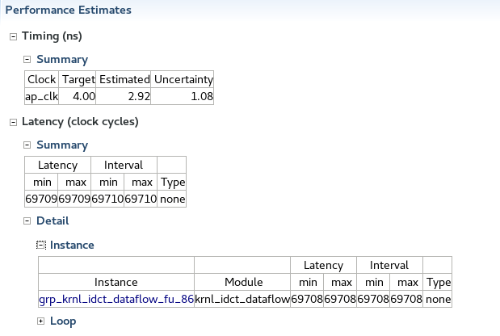

    Open the **krnl_idct_dataflow** module (click on it in hierarchy column to the left). Notice its main contributor is execute (**Performance Estimates -&gt; Latency -&gt; Detail -&gt; Instance**).  

    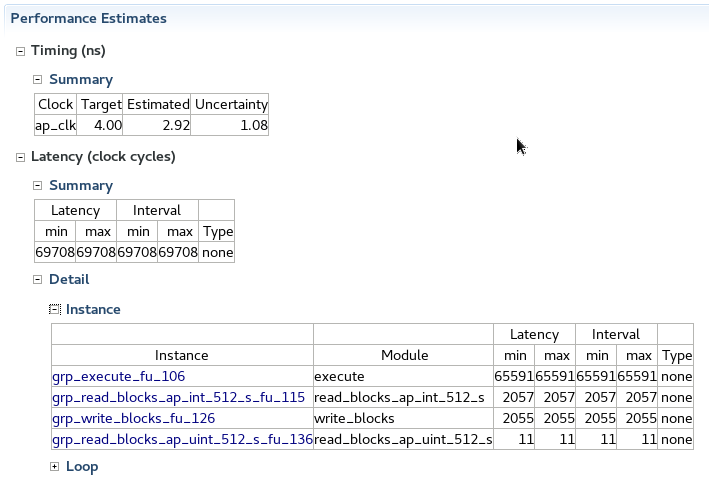  

    Looking at execute loop details (**Performance Estimates -&gt; Latency -&gt; Detail -&gt; Loop**), notice that the latency is actually due to the main loop of the function. This loop is pipelined but the initiation interval (the number of clock cycles before the next iteration of the loop starts to process data) is 64, and also the latency of an iteration is quite large.  

    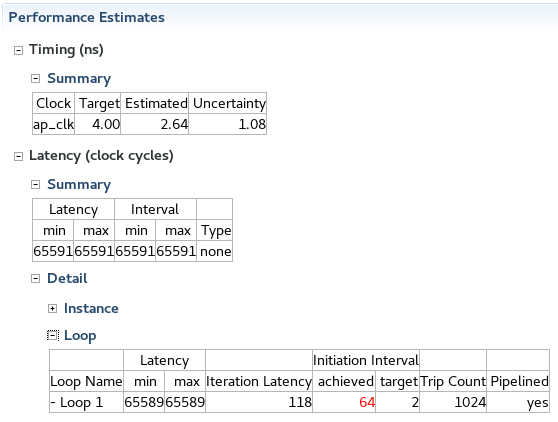  

    The source code of execute (**Project Explorer -&gt; src -&gt; krnl_idct.cpp**), shows that there are three local arrays (iiblock[64], iiq[64], and iivoutp[64]) which are used to hold the local input and output values of the idct. As these arrays are relatively small, they can be mapped to registers rather than memory, which makes them accessible concurrently. This is easily performed through the directive #pragma HLS ARRAY_PARTITION. Uncomment them in the source code, save the file (Ctrl-S), and click  to rebuild the project, . 

1. The newly generated **HLS Report**, shows a considerable reduction in overall latency compared to the previously noted values:

    - Latency (min/max):
    - Interval (min/max):

    This is a very common optimization pattern. As a result for small arrays upto 64 entries, SDAccel usually performs this optimization automatically. For the purpose of this training, this default behavior was disabled with the help of the config.tcl file included earlier. It is not usual to have such a configuration file.

1. Looking at the **HLS Report** of the **krnl_idct_dataflow** function, notice that the latency of each of the functions contained (**Performance Estimates -&gt; Latency -&gt; Detail -&gt; Instance**) within the block are roughly the same. Also if you look at the access pattern of the arrays in execute, read_blocks, and write_blocks, you can see the data is read and written in sequence, making these functions good candidates to benefit from Dataflow optimization.  
    

1. Enable dataflow optimization. **pragma DATAFLOW** is already present in the krnl_idct _dataflow function and just needs to be uncommented. (Refer to [UG1253](https://www.xilinx.com/support/documentation/sw_manuals/xilinx2017_2/ug1253-sdx-pragma-reference.pdf) for details about this pragma). However in summary, it allows each of these functions to execute as independent processes. As a result of this dataflow optimization, the channels between the different processes do not need to buffer the complete dataset anymore but can  directly stream the data to the next block. The additional buffering can be removed by commenting out the three other **pragmas** in the function, defining the FIFO depth of the streams.  Once the code changes are performed, save the file (Ctrl-S), and click  to rebuild the project.

1. Now the kernel has been considerably optimized, we can compare the predicted performance in the Hardware Emulation flow by clicking the run button, .

    - Kernel Total Time (ms):
    - Latency (min/max):
    - Interval (min/max):
 
    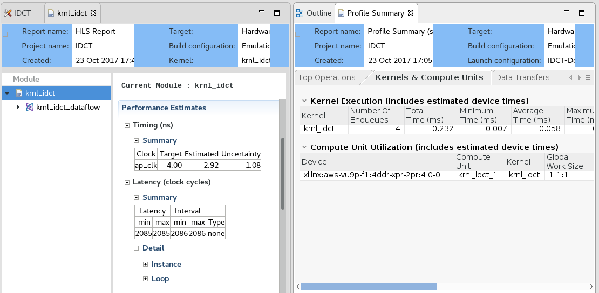

<a name="Executing-on-F1"></a>
## Executing on F1 

Now that we have fully optimized version of the design, we are ready to build the actual hardware bitstream. This process however takes too much time for this tutorial. However, from an SDAccel perspective, the bitstream creation would simply require to switch the active build configuration to System and rebuild.

Once the bitstream is available, in the Amazon F1 instance it is necessary to register the kernel with the secure storage system. This is performed with the help of the **create_sdaccel_afi.sh** script. Running this script kicks off the registration process and it's completion can be verified using the following command.

``` shell
aws ec2 describe-fpga-images --fpga-image-ids <AFI ID>
```

You can try it with the preregistered AFI ID for this tutorial: **afi-0d59c0f2d5fe9df1f**. The output of this command should contain:

``` shell
...
"State": {
    "Code": "available"
},
...
```

A good starting point regarding the specifics of the Amazon SDAccel flow is the 

The registration process creates also a secure bitstream handle "binary_container_1.awsxclbin". This handle is provided to you in your idct directory (~/SC17_Developer_Lab/idct/xclbin/binary_container_1.awsxclbin). Since there is no difference in the host executable, we can run the hardware emulation idct executable with the secure bitstream handle, executing the algorithm on the FPGA.

``` shell
sudo sh
source /opt/Xilinx/SDx/2017.1.rte/setup.sh
<workspace>/IDCT/Emulation-HW/IDCT.exe ~/SC17_Developer_Lab/idct/xclbin/binary_container_1.awsxclbin
```

Please note, the performance differences between the CPU run and the FPGA accelerated implementation.


<a name="Conclusion"></a>
## Conclusion  

In this Lab, you learned:
* How to setup SDx for a blank project.
* How to run Software and Hardware Emulation for a specific project.
* How to read the various reports generated by the different emulation runs with emphasis on key elements used in identifying areas for optimization improvements.
* How to use some basic pragmas in the kernel code to increase performance. 
 
<a name="References"></a>
## References  

[UG902 Vivado Design Suite User Guide: High-Level Synthesis](https://www.xilinx.com/support/documentation/sw_manuals/xilinx2017_2/ug902-vivado-high-level-synthesis.pdf)  
[UG1023 SDAccel Environment User Guide](https://www.xilinx.com/support/documentation/sw_manuals/xilinx2017_2/ug1023-sdaccel-user-guide.pdf)  
[UG1207 SDAccel Environment Optimization Guide](https://www.xilinx.com/support/documentation/sw_manuals/xilinx2017_2/ug1207-sdaccel-optimization-guide.pdf)  
[UG1253 – SDx Pragma Reference Guide](https://www.xilinx.com/support/documentation/sw_manuals/xilinx2017_2/ug1253-sdx-pragma-reference.pdf)
  
  
  
[More references on SDAccel can be found in the Cloud](https://www.xilinx.com/products/design-tools/acceleration-zone.html#knowledgeCenter)


