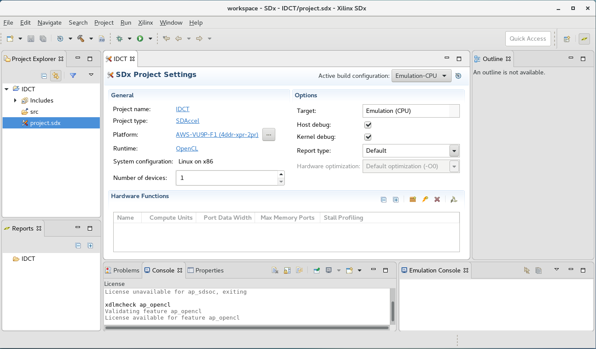
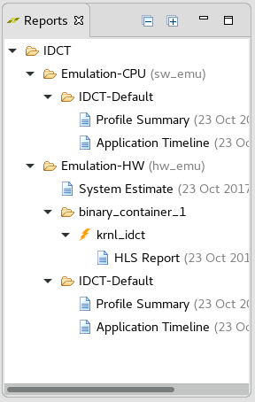
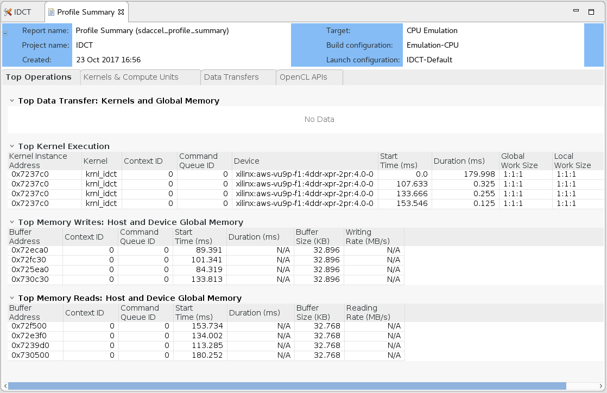
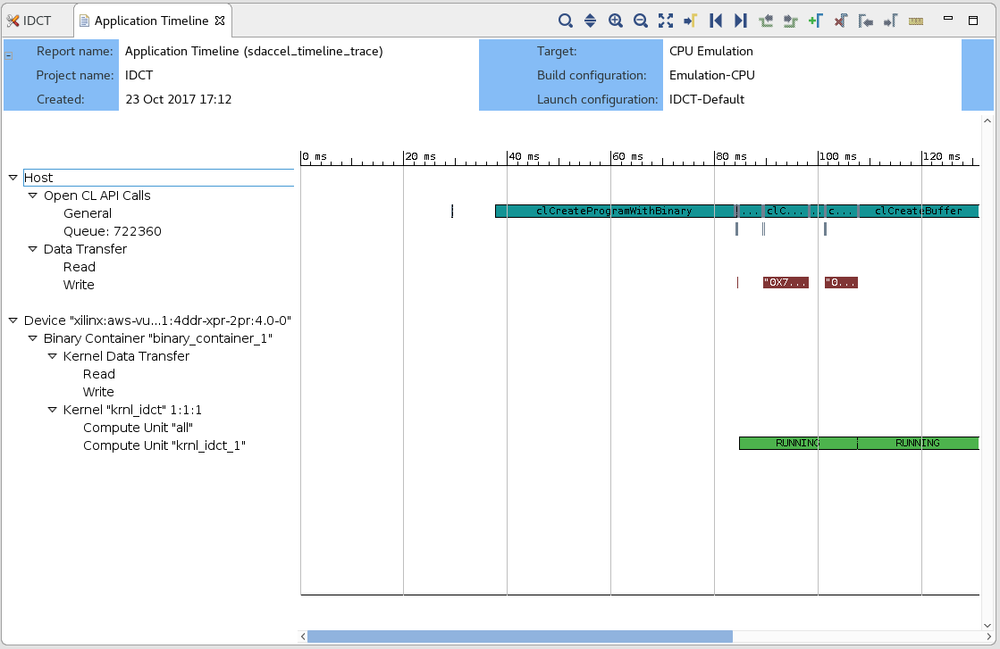
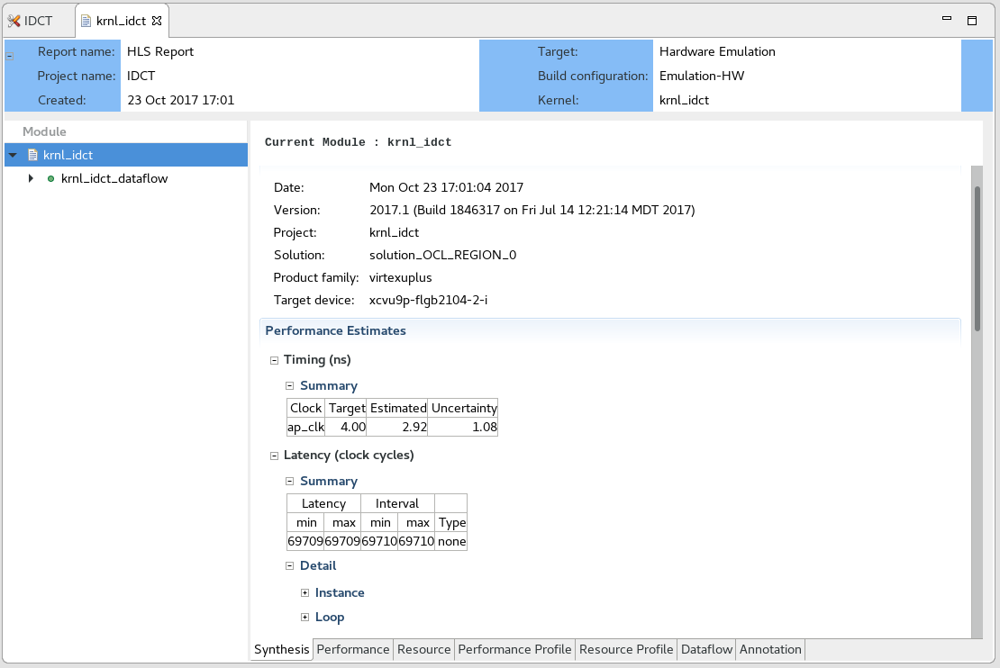
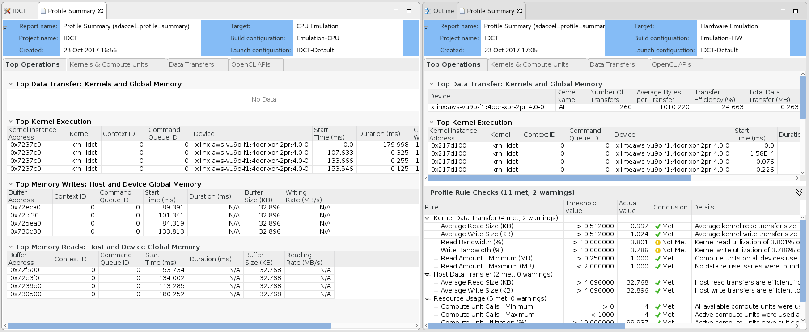
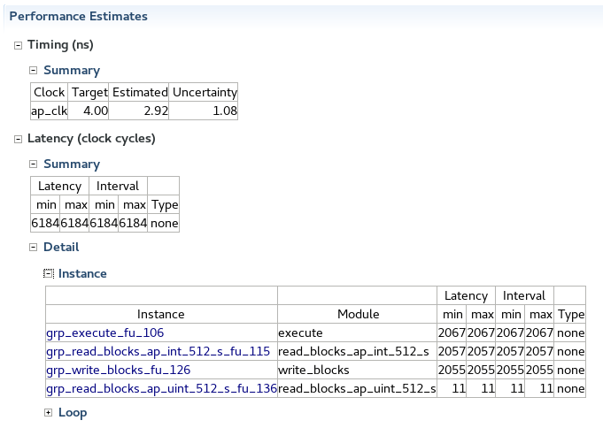

# IDCT Lab

## Contents
1. [Introduction](#Introduction)
1. [Environment Configuration and Workspace Setup](#Setup)
1. [OpenCL Host Initialization](#Init)
1. [Run Emulations](#Emulation)
1. [Analyzing the Reports](#Analyzing)
1. [Optimization](#Optimization)
1. [Executing on F1](#Executing-on-F1)
1. [Conclusion](#Conclusion)
1. [References](#References)

<a name="Introduction"></a>
## Introduction  
This tutorial is designed to help teach the basics of the SDAccel development process. Areas covered include running software and hardware emulation and report analysis to help identify how to optimize code on the host and kernel side. Additionally, at the end of the tutorial, various links are provided to resources which provide details on various aspects of optimizing kernel code for projects.

The design is a Inverse Discrete Cosine Transform, which is used heavily in audio/image processing and is based off of the Fourier Transform. Please refer to the Wikipedia article  [Discrete Cosine Transform](https://en.wikipedia.org/wiki/Discrete_cosine_transform) for more information. 

 
<a name="Setup"></a>
## Environment Configuration and Workspace Setup
Before the SDAccel tool suite can be started, the environment needs to be configured. Follow these steps:

1.  Change into the ~/aws-fpga directory and source “sdaccel_setup.sh” <br>
    ```
    cd ~/aws-fpga
    source sdaccel_setup.sh
    source $XILINX_SDX/settings64.sh 
	cd ~
    ```
    The setup might create some warning messages regarding missing libraries but these can be safely ignored.

1. Launch SDx with the command: 
    ```
    sdx
    ```
	
1. The **Eclipse Launcher** will start up displaying the workspace directory menu. This allows you to select the location of your workspace (and projects). To simplify this tutorial, a workspace directory containing the basic configuration for this example design is already included in the lab repository. To select this workdirectory, we select **Browse…** and navigate to **/home/centos/SC17_Developer_Lab/workspace**. After pressing **OK** the **Eclipse Launcher** should read:  
      
    Click **OK** to confirm the selection.  
	
	The provided workspace:
	* Defines the new project with the name **IDCT**
	* Has the project associated with the AWS platform from the aws-fpga platform directory 
	* Includes the host (**idct.cpp**) and kernel (**krnl_idct.cpp**) source files
	* Defines the name of the xclbin container as **binary_container_1**
	* Defines the **krnl_idct** function to be the top hardware function in the xclbin container
    * Maps the ports of the **krnl_idct** function to utilize two different DDR memories; one for reads and one for writes. 
	* Adds the xclbin container to be the first argument provided to the executable.

	Most of this information is displayed on the **SDX Project Settings** window or can be located in the **Project -&gt; Properties** configuration tabs.  
 
    

1. TheSDx Project Settings window is prominently displayed in the center of the GUI. It states the project name, the selected platform (**AWS-VU9-F1**) and the xclbin container (**binary_container_1**) with the top level kernel function (**krnl_idct**). __
The following is a brief description of the different sections of the default GUI elements (see above for reference):
    * The **main menu** bar is located on the top. This menu bar allows direct access to all general project setup and GUI window management tasks. As most tasks are performed through the different setup windows, the main menu is mostly used to recover from accidently closed windows or to access the tool help.
    * Directly below the main menu bar is the **SDAccel toolbar**.  This provides access to the most common tasks in a project. From left to right, these are: File Management functions (new, save, save all), Configuration Management, Build, Build All, Start Debug, and Run. Most buttons have a default behavior as well as pulldowns.
    * The **Project Explorer** window occupies the top left hand side of the GUI. This window is used to manage and navigate through project files. In the expanded src folder you should be able to see the source files of the project. 
    * In the middle is the **SDx Project Settings** window. This window is intended for project management and presents the key aspects of an SDx Project. 
    * The **Outline window** on the right hand side is used for file navigation. The content of the outline varies depending on the file currently selected in the main window.
    * In the bottom left section is the **Reports window**. This allows easy access to all reports generated by SDAccel. 
    * The remaining windows along the bottom of the main window accommodate the various consoles and terminals which contain output information relating to individual SDAccel executables. Typical output examples are compilation errors or the tool output when running.  

<a name="Init"></a>
## OpenCL Host Initialization  

Before we start looking at the details of the kernel and host implementation of this example, it is worth while to briefly have a look at the OpenCL setup steps in the host. This code is very similar between SDAccel projects and might often only vary in the error handling. Towards that end, please open the **idct.cpp** file from the **Project Explorer** and search for the line:

``` C
  // *********** OpenCL Host Code Setup **********
```

People familiar with OpenCL should be very familiar with these steps. All of these interface functions are documented by the OpenCL maintainer [(Khronos group)](https://www.khronos.org). In the code, the following OpenCL calls are made.

* **clGetPlatformIDs**: This function queries the the system to identify the different OpenCL platforms. It is called twice as it first extracts the number of platforms before extracting the actual supported platforms.
* **clGetPlatformInfo**: Get specific information about the OpenCL platform, such as vendor name and platform name.
* **clGetDeviceIDs**: Optain list of devices available on a platform.
* **clCreateContext**: Creates an OpenCL context.
* **clGetDeviceInfo**: Get information about an OpenCL device like the device name.
* **clCreateProgramWithBinary**: Creates a program object for a context, and lo
ads specified binary data into the program object. The actual program is obtaine
d before this call through the load_file_to memory function.
* **clCreateKernel**: Creates a kernel object.
* **clCreateCommandQueue**: Create a command-queue on a specific device.

Note, all objects accessed through a **clCreate...** function call are to be released before terminating the program by calling **clRelease...**. This avoids memory leakage and clears the locks on the device.


<a name="Emulation"></a>
## Run Emulations (Software/Hardware)  

This section demonstrates the software/hardware emulation flow. 

The project is now setup and ready for compilation and emulation. The SDx environment uses Makefiles to perform incremental compilation of the project. This means that unless file changes require the recompilation of the host code or of the kernel code, no compilation is performed.

In the upper right corner of the **SDx Project Settings** window, the current configuration is shown. Ensure that **“Emulation-CPU”** is selected. CPU-Emulation is intended to verify the algorithm and identify syntax issues through pure C/C++ emulation. To run software emulation for the design, click the **Run** button, . This will build both the kernel and host code and execute emulation.

Notice that the **Console** has a detailed build log of compiling the kernel first and then the host code. Once the build is complete, an output console will display any standard output the application produces. 

When the software emulation is complete:

   Click the dropdown **Emulation-CPU** in the **SDx Project Settings** window. 
   
   Select **Emulation-HW**. 
    
Now the project is set for running a more detailed emulation compared to the software emulation. In this emulation mode the actual Register Transfer Logic (RTL) generated from the C/C++ is simulated and run together with the host code application. 

Click the **Run** button again.

The runtime of the Hardware emulation will take longer than the Software Emulation because the kernel code is being compiled to create the more detailed simulation models and links with the platform. In addition, the more detailed simulation models require more simulation time. However, this allows more accurate reporting of kernel performance in comparison to software emulation. This step should be used in helping identifying performance issues of the design.

The next section will focus on analyzing the reports produced by both analysis runs. 

<a name="Analyzing"></a>
## Analyzing the Reports  

This section covers how-to locate and read the various reports generated by the emulation runs. The goal of the section is to understand the analysis reports of SDAccel before utilizing them in the next section.  
    

1. The **Reports** window displays a tree layout of folders and reports for all runs and open projects (see above). The top level shows the **IDCT** project for which we have executed two runs (**Emulation-CPU** and **Emulation-HW**).

    Expanding the **Emulation-CPU** folder shows the **IDCT-Default** run configuration. Running this configuration created a **Profile Summary** and **Application Timeline** report. 

    Similarly, the **Emulation-HW** folder contains all reports created with this build configuration. However, as this configuration performs High-Level Synthesis under the hood, first estimates regarding the performance of the actual hardware implementation are available. These are summarized in **System Estimate** and and are also accessible in more detail from the **HLS Report** located in the **binary_container_1 -&gt; krnl_idct** subhierarchy. Similar to the emulation-cpu flow, the run configuration **IDCT-Default** also produced a **Profile Summary** and an **Application Timeline** report.

1. First look at the **Emulation-CPU Profile Summary**. Double click the **Profile Summary** to open the report (see below).   
     

    This report provides data related to how the application runs. Notice that the report has four tabs: **Top Operations**, **Kernels & Compute Units**, **Data Transfers**, and **OpenCL APIs**. Click through and study each of the tabs and become familiar with the data they show. Following is a summary of each:

    **Top Operations**: Shows all the major top operations of memory transfer between the host and kernel to global memory, and kernel execution. This allows you to identify throughput bottlenecks when transferring data. Efficient transfer of data to the kernel/host allows for faster execution times.
    
    **Kernels & Compute Units**: Shows the number of times the kernel was executed. Includes the total, minimum, average, and maximum run times. If the design has multiple compute units, it will show each compute unit’s utilization. When accelerating an algorithm, the faster the kernel executes, the higher the throughput which can be achieved. It is best to optimize the kernel to be as fast as it can be with the data it requires.
    
    **Data Transfers**: This tab has no bearing in software emulation as no actual data transfers are emulated across the host to the platform. In hardware emulation, this shows the throughput and bandwidth of the read/writes to the global memory that the host and kernel share.
    
    **OpenCL APIs**: Shows all the OpenCL API command executions, how many time each was executed, and how long they take to execute.

1. Now examine the **Application Timeline** report. Double click it in the **Emulation-CPU** hierarchy. This shows a visual representation of the **OpenCL APIs** from the **Profile Summary** and in what order the APIs execute across the emulation threads (see below).  
    

1. Next, look at the **Emulation-HW** reports. Double click on the **HLS Report**. This report is specific to the kernel code, and how it translates to the platform. It contains information about clocking, resources, device utilization, and more. For the purpose of this tutorial, the only section of this report to pay attention to is the **Performance Estimates**. This section provides information on the latency of the kernel, as well as loop implementation details (see below).  
    

1. Close all reports before moving on to comparing two reports side by side. Click **X** on each of the report tabs to close.

1. Open the **Profile Summary** of the **Emulation-HW** run. Drag it to the right (next to the Outline tab) such that the center window can be used to show the **Profile Summary** of the **Emulation-CPU** run. This allows you to directly compare the two reports. Based on your screen, to allow the maximum information to be displayed, it may be best to maximize the application window and minimize the Project Explorer and Reports windows (see below).  
    
 
1. Notice that compared to the CPU emulation, the hardware emulation displays more data as well as a **Profile Rule Checks** section. This section provides information relating to the overall design performance. Profile rules examine the profile data and compare them to general threshold values. If a check does not meet the threshold value, the right hand column provides guidance on how to improve design performance.

1. Click on the **Kernels & Compute Units** tabs of both reports to compare the software and hardware emulation reports of the kernel execution. Notice that in software emulation, the total time is significantly more than in hardware emulation. This is because in software emulation, the host and kernel are running only on the CPU, while the hardware emulation is running in a simulation mode that emulates what the platform would be executing. This sounds counter-intuitive given that the Hardware Emulation wall clock runtime is much larger. However, this longer runtime is due to the much greater detail of the simulation run.
 
1. Next, take some measurements to establish a baseline of the current implementation of the design. To do this, note the values for the following from the **Profile Summary** report of the **Emulation-CPU** run:

    - Kernel Total Time (ms):
    - Kernel Min Time (ms):	
    - Kernel Max Time (ms):	


    Then for the Emulation-HW configuration, note the **Kernel Total Time** from the **Profile Summary** and from the **HLS Report -&gt; Performance Estimates** section the latency and interval numbers. 

    - Kernel Total Time (ms):
    - Latency (min/max):
    - Interval (min/max):	

This concludes the introduction to the SDAccel GUI Analysis capabilities. The next section will focus on some of the performance aspects of the current implementation and how they can be improved.  

<a name="Optimization"></a>
## Optimization   

In the previous section you familiarized with the SDAccel Performance Analysis capabilities. The next stage is to utilize the analysis capabilities to determine results of kernel optimization procedures. This example will deal with [DATAFLOW optimization on for the accelerator](#KernelOpt) and [software pipelining on the host side](#HostOpt).

<a name="KernelOpt"></a>
### Kernel Optimization  

1. Let us start by looking at the acceleration of the hardware algorithm. Open the kernel file **krnl_idct.cpp** by double clicking the file at the bottom in **Project Explorer**. At the end of the file is the krnl_idct top function which is used to separate the HLS interface pragmas from the actual kernel definition function (krnl_idct_dataflow) for readability. The krnl_idct_dataflow function contains four blocks:

    * Two read_blocks responsible for mapping the AXI interface to a data stream
 
    * One write_block responsible for mapping from the data stream to the output AXI interface
 
    * One execute block which contains the IDCT computation

    The execute function performs multiple idct computations per kernel execution. The actual number is provided to the kernel as an argument. Each computation is prepended by reading the wide input data streams and filling the 8x8 matrix, and similarly post processed by writing into the wide output streams. 
    
    **Note:** The coefficients of the read operation are read only once as they are considered constant for all idct computations.

1. Looking at the **HLS Report** of the **krnl_idct_dataflow** function, notice that the latency of each of the functions contained (**Performance Estimates -&gt; Latency -&gt; Detail -&gt; Instance**) within the block are roughly the same for the main read, execute, and write block. Also if you look at the access pattern of the arrays in the kernel source in the functions execute, read_blocks, and write_blocks, you can see the data is read and written in sequence, making these functions good candidates to benefit from Dataflow optimization.  
    

1. Enable dataflow optimization. **pragma DATAFLOW** is already present in the krnl_idct _dataflow function and just needs to be uncommented. (Refer to [UG1253](https://www.xilinx.com/support/documentation/sw_manuals/xilinx2017_2/ug1253-sdx-pragma-reference.pdf) for details about this pragma). However in summary, it allows each of these functions to execute as independent processes. As a result of this dataflow optimization, the channels between the different processes do not need to buffer the complete dataset anymore but can  directly stream the data to the next block. The additional buffering can be removed by commenting out the three other **pragmas** in the function, defining the FIFO depth of the streams.  Once the code changes are performed, save the file (Ctrl-S), and click  to rebuild the project.

    This results in the following new HLS Report:  
    	

1. If we run the Hardware Emulation flow by clicking the run button, . We can look at the predicted performance numbers in the **Profile Summary -&gt; Kernels & Compute Units** of the HW emulation run.  

    

    From these reports, we can note down the expected kernel performance numbers and compare them to the original numbers.
    
    - Kernel Total Time (ms):
    - Latency (min/max):
    - Interval (min/max):	


<a name="HostOpt"></a>
### Host Optimization

1. We start by briefly looking at the runtime host code of the idct. For that, we locate the **runFPGA** function in the **idct.cpp** source file. This function basically writes, runs, and reads back from the kernel, for each idct kernel invocation until all blocks are processed. In the end it waits for the complete command queue to finish.

    If we look closer, the majority of the **write(...)** function code performs basically buffer management. It creates new OpenCL buffers for the different sections of the inputs and output. All the way at the end of the write function, there is a call to clEnqueueMigrateMemObjects which is used to transfer the data to the kernel. Completion of the write is indicated by an **inEvVec** event. 
	
	The **run(...)** function sets up the kernel arguments (**clSetKernelArg**) and then enqueues the task (**clEnqueueTask**). The run function is allowed to start once the input vectors are fully transfered (**inEvVec**) and reports completion through the **runEvVec**.
	
	Finally there is the **read(...)** function which simply retrieves the data from the output buffer, synchronized through **runEvVec** and **outEvVec**.
	
1. Now let us take a look at the **Application Timeline** of the **Emulation-HW** run. Even from the zoomed out view, we can identify gaps between the different kernel runs. If we zoom in (**Left mouse drag**) accross on of these gaps, you will see a timeline very similar to the one below:  
    

    The timeline clearly shows that in the gap between the kernel execution (light green), the previous results are read back to the host (dark blue), host code schedules new operations to the queue(light blue, dark green), and new data is written into the kernel buffer (brown). This basically represents a sequential execution flow of each iteration.   

    If we take another look at the host code, we can actually see in addition to the **clFinish()** function call another synchronization point through a call to **clWaitForEvents(...)** in the **write(...)** function. It gates the release of memory and event resources based on completion of the task (**outEvVec**). If we look for the definition of **outEvVec**, we can see that the number of elements in this vector is defined through the **NUM_SCHED** define. This however is set to **1** at the top of the class. 
	
	The **1** explains the currently observed behavior, as new tasks (write, run, read) are only enqueued when the previous has completed effectively synchronizing each loop iteration. If we deploy software pipelining and enable for example **6** blocks to be enqueued for processing, we will effectively allow the kernels to execute the kernels continuously.
	
	Thus, let us change the **NUM_SCHED** to **#define NUM_SCHED 6**, save the file Ctrl-S, and rerun HW-Emulation, . This rebuilds only the host code and reruns the executable. Once competed, reopen the **Application Timeline** and you will be able to observe that the data transfer is performed concurrently with the read and write operations.  
    
	
	Note, hardware emulation has a larger potential that other system tasks might interrupt and slow down communication. Thus the effect of software pipelining is considerably higher when running on the actual hardware. 

<a name="Executing-on-F1"></a>
## Executing on F1 

Now we are ready to run a fully optimized version of the design. However, the process to create the actual FPGA image (xclbin) takes too much time for this tutorial. From a SDAccel tool perspective, the xclbin creation would simply require to switch the active build configuration to System and rebuild.

Once the xclbin is available, in the Amazon F1 instance it is necessary to register the kernel with the secure storage system. This is performed with the help of the **create_sdaccel_afi.sh** script. Running this script kicks off the registration process and it's completion can be verified using the following command.

``` shell
aws ec2 describe-fpga-images --fpga-image-ids afi-0d59c0f2d5fe9df1f
```

You can try it with the preregistered AFI ID for this tutorial: **afi-0d59c0f2d5fe9df1f**. The output of this command should contain:

``` shell
...
"State": {
    "Code": "available"
},
...
```

A good starting point regarding the specifics of the Amazon SDAccel flow is the 

The registration process creates also a secure xclbin handle "binary_container_1.awsxclbin". This handle is provided to you in your idct directory (~/SC17_Developer_Lab/idct/xclbin/binary_container_1.awsxclbin). Since there is no difference in the host executable, we can run the hardware emulation idct executable with the secure bitstream handle, executing the algorithm on the FPGA.

``` shell
sudo sh
source /opt/Xilinx/SDx/2017.1.rte/setup.sh
/home/centos/SC17_Developer_Lab/workspace/IDCT/Emulation-HW/IDCT.exe /home/centos/SC17_Developer_Lab/idct/xclbin/binary_container_1.awsxclbin
```


<a name="Conclusion"></a>
## Conclusion  

In this Lab, you learned:
* The basic setup of a project.
* How to run Software and Hardware Emulation for a specific project.
* How to read the various reports generated by the different emulation runs with emphasis on key elements used in identifying areas for optimization improvements.
* How to use some basic pragmas in the kernel code to increase performance.
* How to analyse communication betweeen host code and an implementation kernel.
 
<a name="References"></a>
## References  

[UG902 Vivado Design Suite User Guide: High-Level Synthesis](https://www.xilinx.com/support/documentation/sw_manuals/xilinx2017_2/ug902-vivado-high-level-synthesis.pdf)  
[UG1023 SDAccel Environment User Guide](https://www.xilinx.com/support/documentation/sw_manuals/xilinx2017_2/ug1023-sdaccel-user-guide.pdf)  
[UG1207 SDAccel Environment Optimization Guide](https://www.xilinx.com/support/documentation/sw_manuals/xilinx2017_2/ug1207-sdaccel-optimization-guide.pdf)  
[UG1253 – SDx Pragma Reference Guide](https://www.xilinx.com/support/documentation/sw_manuals/xilinx2017_2/ug1253-sdx-pragma-reference.pdf)
  
  
  
[More references on SDAccel can be found in the Cloud](https://www.xilinx.com/products/design-tools/acceleration-zone.html#knowledgeCenter)


